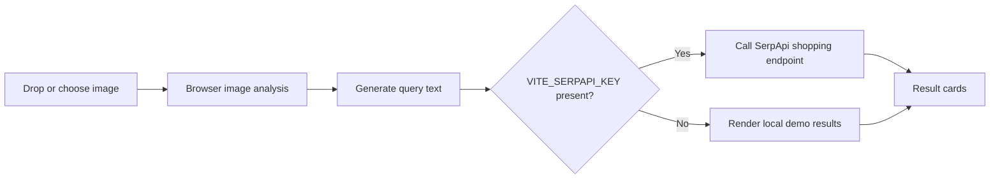

# SearchLock Browser Demo

SearchLock is a browser-first proof of concept for privacy-aware visual shopping search.

It demonstrates the full product loop in a lightweight, shareable form:

1. A user drops or selects an image.
2. The browser analyzes the image locally.
3. The app derives a search query from the image.
4. Live shopping results are fetched from SerpApi when a key is configured.
5. If no key is present, the UI still renders clearly labeled demo cards.

## Why this version exists

The project was re-scoped away from Android so the concept can be reviewed, tested, and demoed without an emulator or native build chain.

## Data flow



## What is included

- **AI / machine learning behavior**: image-derived query generation in `web/imageAnalysis.ts`
- **User interface**: drag-and-drop browser demo in `web/App.tsx`
- **Real search integration**: SerpApi shopping search in `web/search.ts`
- **Production build path**: Vite + TypeScript

## Core dependencies

| Dependency | Why it exists |
|---|---|
| `react` | UI rendering |
| `react-dom` | Browser DOM mounting |
| `vite` | Fast dev server and production bundling |
| `@vitejs/plugin-react` | React transforms for Vite |
| `typescript` | Static typing |
| `eslint` | Code quality checks |

## Main components

| File | Responsibility |
|---|---|
| `index.html` | Vite host page |
| `web/main.tsx` | React entry point |
| `web/App.tsx` | UI, upload handling, rendering |
| `web/imageAnalysis.ts` | Local browser-side image analysis |
| `web/search.ts` | Live SerpApi search with fallback results |
| `web/styles.css` | Layout and visual styling |
| `vite.config.ts` | Local server / build configuration |
| `tsconfig.web.json` | Browser TypeScript config |

## How the browser demo works

### 1) Image input

The user can drag and drop a file or use the file picker. The app accepts image formats supported by modern browsers.

### 2) Local analysis

`web/imageAnalysis.ts`:

- loads the image in the browser
- samples pixels on a canvas
- estimates brightness and dominant color
- detects aspect ratio
- creates a readable shopping-style query

This is the AI-inspired part of the proof of concept: it transforms raw image input into useful search intent.

### 3) Shopping search

`web/search.ts`:

- checks for `VITE_SERPAPI_KEY`
- if the key exists, it calls SerpApi’s shopping search endpoint
- if the key is missing or the request fails, it returns demo cards so the UI still works

### 4) Result presentation

`web/App.tsx` renders:

- the preview image
- the analysis details
- the generated query
- the result cards

## Setup on another device

```bash
git clone <your-repo-url>
cd SearchLock
npm install
```

Create your local environment file:

```bash
copy .env.example .env
```

Then edit `.env` and add your SerpApi key if you want live results:

```env
VITE_SERPAPI_KEY=your_real_serpapi_key_here
```

Run the app:

```bash
npm run dev
```

Open the localhost URL shown in the terminal.

## Build and deployment

### Local production build

```bash
npm run build
npm run preview
```

### Static deployment

This project builds to a static site, so it can be deployed to any static host such as:

- Vercel
- Netlify
- GitHub Pages
- Cloudflare Pages

Deployment flow:

1. Run `npm run build`
2. Upload the generated `dist/` folder to your host
3. Set `VITE_SERPAPI_KEY` in the host’s environment settings if you want live results

## Environment files

- **`.env.example`** is the tracked template. It documents the variable names and keeps placeholders empty.
- **`.env`** is your local private configuration. It contains real secrets and should not be committed.

In short: `.env.example` explains what is needed; `.env` stores the actual values.

## Commands

```bash
npm run dev
npm run build
npm run preview
npm run lint
npm run typecheck
```

## Repository layout

- `web/` — browser application source
- `AI_DOCS/` — condensed technical documentation
- `index.html` — Vite entry page
- `vite.config.ts` — build config
- `.env.example` — environment template

## Real results vs fallback behavior

- With `VITE_SERPAPI_KEY` configured, SearchLock returns live shopping results.
- Without it, the UI still works and returns demo cards so the flow remains testable.

## Documentation

- `AI_DOCS/README.md` — documentation index
- `AI_DOCS/TECHNICAL_REFERENCE.md` — component summary and technical notes

This repository is now intentionally browser-first and ready for a clean GitHub presentation.
